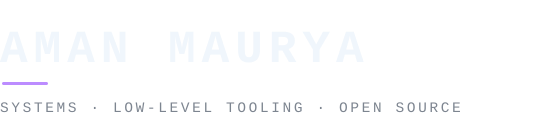

<!--
  Profile README for github.com/amanmaurya92
  Accent colour is #bc8cff (GitHub violet / Hollow Purple) — matched with the
  vibrant palette of assets/gojo.gif.
  Typographic furniture: assets/art/* generated via scripts/generate-art.mjs.
-->

<table>
<tr>
<td width="62%" valign="top">




I build software close to the metal — systems tooling that stays out of your
way, runtimes that don't leak, and code built to survive the real world.

When I'm not building my own tools, I explore compiler & runtime internals and send patches upstream.

</td>
<td width="38%" valign="top">


<sub><i>infinite void — calm is a property of systems that recover</i></sub>

</td>
</tr>
</table>

```console
$ whoami --verbose

  handle      amanmaurya92
  founder     RabbitBase
  upstream    swiftlang · dart-lang · CNCF
  builds      systems · database engines · compilers & runtimes
  languages   C++ (close to the metal) · C · Go · Rust · Swift · Dart
  rule        simplicity is prerequisite for reliability
```


- Building and scaling **RabbitBase** — engineering high-performance systems and resilient infrastructure
- Contributing upstream to **Swiftlang** (compiler diagnostics, standard library & runtime internals)
- Hacking on **Dartlang** toolchains, SDK architecture, and runtime ergonomics
- Participating in **CNCF** ecosystem initiatives and cloud-native primitives


<table>
<tr>
<td width="50%" valign="top">

###  [RabbitBase](https://github.com/RabbitBase) <sub>· founder</sub>

Founding and architecting core infrastructure — building distributed, resilient systems and high-throughput data engines engineered to handle critical workloads without compromise.

`Founder` `Systems Architecture` `Distributed Systems` `C++` `Go`

</td>
<td width="50%" valign="top">

###  [Swiftlang](https://github.com/swiftlang) <sub>· upstream</sub>

Upstream contributions to the Swift programming language and compiler ecosystem. Focusing on compiler diagnostics, runtime performance, LLVM code generation, and low-level system tooling.

`Swift` `C++` `LLVM` `Compiler Architecture`

</td>
</tr>
<tr>
<td width="50%" valign="top">

###  [Dartlang](https://github.com/dart-lang) <sub>· upstream</sub>

Contributing to Dart SDK infrastructure, runtime internals, and language ergonomics. Improving native toolchains, platform interop, virtual machine performance, and developer-facing utilities.

`Dart` `C++` `Virtual Machine` `SDK & Tooling`

</td>
<td width="50%" valign="top">

###  [CNCF](https://github.com/cncf) <sub>· upstream</sub>

Upstream contributions across Cloud Native Computing Foundation ecosystems — hardening cloud infrastructure, microservice orchestration, and container networking primitives.

`Cloud Native` `Go` `Kubernetes` `Infrastructure`

</td>
</tr>
</table>


```text
  languages   C · C++ · Go · Rust · Swift · Dart · Python · Bash
  systems     Linux · POSIX APIs · Distributed Storage · Concurrency · Docker · Kubernetes
  toolchains  LLVM · Clang · CMake · Ninja · Compiler & VM Internals
  tooling     Neovim · GDB · Valgrind · Git · GitHub Actions · VS Code
```


- **Measure before optimizing**: Profile first; mechanical sympathy beats intuition.
- **Fail loud, fail early**: If an invariant breaks, crash predictably rather than corrupting state.
- **Minimal dependencies**: Every external dependency is code you didn't write but still have to maintain.


- **LinkedIn**: [in/amanmaurya92096](https://www.linkedin.com/in/amanmaurya92096/)
- **GitHub**: [@amanmaurya92](https://github.com/amanmaurya92)
